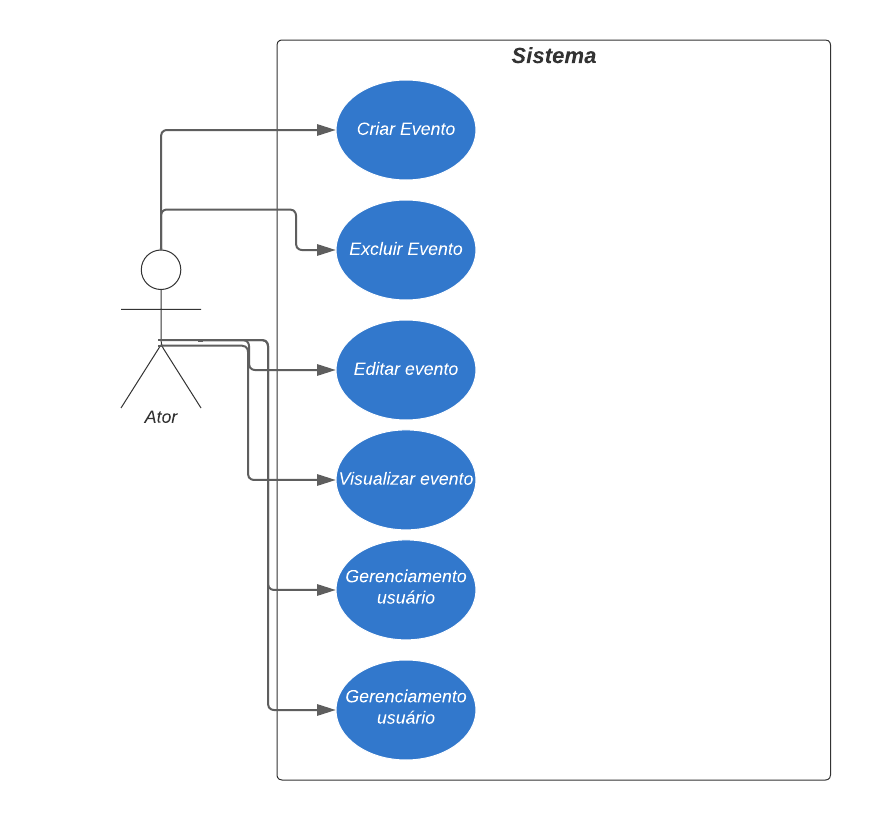

# Especificações do Projeto

Pré-requisitos: <a href="1-Documentação de Contexto.md"> Documentação de Contexto</a>

Definição do problema e ideia de solução a partir da perspectiva do usuário. É composta pela definição do  diagrama de personas, histórias de usuários, requisitos funcionais e não funcionais além das restrições do projeto.

Apresente uma visão geral do que será abordado nesta parte do documento, enumerando as técnicas e/ou ferramentas utilizadas para realizar a especificações do projeto

## Personas

1. Maria, 40 anos, Empresária:
* Maria tem 40 anos e é empresaria, ela  participa de diversos eventos de negócios e precisa manter contato com os outros participantes para networking. Ela também precisa acompanhar as palestras e workshops que está participando, mas nem sempre consegue se lembrar de todos os nomes e informações dos palestrantes.

 2. João, 35 anos, Organizador de eventos:
* João Paulo tem 29 anos, ele é um palestrante e acaba organizando eventos de grande porte e acaba  por precisar de uma maneira eficiente de gerenciar a entrada e a saída dos participantes. Ele também precisa identificar rapidamente os participantes que já chegaram ao evento.

3. Ana, 25 anos, Estudante:

* Ana participa de vários eventos universitários, como palestras, workshops e congressos. Ela frequentemente se perde em meio à multidão e tem dificuldade em encontrar os amigos e colegas com quem combinou de se encontrar.

## Histórias de Usuários

Com base na análise das personas forma identificadas as seguintes histórias de usuários:

|EU COMO... `JOÃO, organizador de eventos`| QUERO/PRECISO ... `FUNCIONALIDADE` |PARA ... `MOTIVO/VALOR`                 |
|--------------------|------------------------------------|----------------------------------------|
|Usuário do sistema  | Gerenciar o fluxo de pessoas de forma eficiente           | Melhor controle do evento               |
|Palestrante      | Permite que João adicione, remova participantes               | Controlar a entrada dos participantes |

|EU COMO... `MARIA, a empresaria`| QUERO/PRECISO ... `FUNCIONALIDADE` |PARA ... `MOTIVO/VALOR`                 |
|--------------------|------------------------------------|----------------------------------------|
|Usuário do sistema  | Notifica Maria sobre próximos eventos        | Controle pessoal                |
|Empresaria   |    Fornece a lista com nome dos participantes          | Fazer Networking |

|EU COMO... `ANA, a estudante`| QUERO/PRECISO ... `FUNCIONALIDADE` |PARA ... `MOTIVO/VALOR`                 |
|--------------------|------------------------------------|----------------------------------------|
|Usuário do sistema  |  Filtro por nome       | Facilita a busca por pessoas específicas na lista de participantes              |
|Estudante      | Organização por adição de tarefas              | Melhor controle de suas tarefas |

## Modelagem do Processo de Negócio 

### Análise da Situação Atual

Apresente aqui os problemas existentes que viabilizam sua proposta. Apresente o modelo do sistema como ele funciona hoje. Caso sua proposta seja inovadora e não existam processos claramente definidos, apresente como as tarefas que o seu sistema pretende implementar são executadas atualmente, mesmo que não se utilize tecnologia computacional. 

### Descrição Geral da Proposta

Apresente aqui uma descrição da sua proposta abordando seus limites e suas ligações com as estratégias e objetivos do negócio. Apresente aqui as oportunidades de melhorias.

### Processo 1 – NOME DO PROCESSO

Apresente aqui o nome e as oportunidades de melhorias para o processo 1. Em seguida, apresente o modelo do processo 1, descrito no padrão BPMN. 

### Processo 2 – NOME DO PROCESSO

Apresente aqui o nome e as oportunidades de melhorias para o processo 2. Em seguida, apresente o modelo do processo 2, descrito no padrão BPMN.

## Indicadores de Desempenho

Apresente aqui os principais indicadores de desempenho e algumas metas para o processo. Atenção: as informações necessárias para gerar os indicadores devem estar contempladas no diagrama de classe. Colocar no mínimo 5 indicadores. 

Usar o seguinte modelo: 

Obs.: todas as informações para gerar os indicadores devem estar no diagrama de classe a ser apresentado a posteriori. 

## Requisitos

As tabelas que se seguem apresentam os requisitos funcionais e não funcionais que detalham o escopo do projeto. Para determinar a prioridade de requisitos, aplicar uma técnica de priorização de requisitos e detalhar como a técnica foi aplicada.

### Requisitos Funcionais

|ID    | Descrição do Requisito  | Prioridade |
|------|-----------------------------------------|----|
|RF-001|O usuário deve ser capaz de acessar o aplicativo, independentemente de estar autenticado ou não.| ALTA | 
|RF-002| 	O usuário pode recuperar a senha caso a esqueça  | ALTA |
|RF-003| O usuário pode criar um novo evento, inserindo um nome ou título para ele. | MÉDIA |
|RF-004|O usuário pode adicionar participantes a um evento específico, fornecendo seus nomes.| MÉDIA | 
|RF-005| O usuário pode remover participantes de um evento existente.| MÉDIA | 
|RF-006|O usuário pode editar o nome ou outros detalhes de um evento.| MÉDIA | 
|RF-007|O aplicativo pode enviar notificações aos participantes sobre eventos próximos ou alterações nos eventos.| MÉDIA | 
|RF-008|O usuário pode pesquisar eventos existentes com base em palavras-chave ou datas.| BAIXA | 

### Requisitos não Funcionais

|ID     | Descrição do Requisito  |Prioridade |
|-------|-------------------------|----|
|RNF-001| O sistema deve ser responsivo para rodar em um dispositivos móvel | ALTA | 
|RNF-002| A interface do aplicativo deve ser intuitiva e fácil de usar, com elementos de design coerentes e uma experiência agradável para o usuário. |  ALTA | 
|RNF-003| O aplicativo deve ser responsivo e rápido, com tempos de carregamento mínimos para evitar frustração do usuário. | MEDIA |
|RNF-004|  Os dados dos participantes e eventos devem ser armazenados de forma segura, com criptografia adequada e proteção contra acesso não autorizado. | ALTA |
|RNF-005|  O aplicativo deve ser capaz de lidar com um grande número de eventos e participantes sem comprometer o desempenho| BAIXA |
|RNF-006| O aplicativo deve ser acessível para pessoas com deficiências visuais ou motoras, seguindo as diretrizes de acessibilidade. | MÉDIA |
|RNF-007| O usuário pode realizar filtragem entre os participantes da lista | BAIXA |
|RNF-008| O aplicativo deve ser otimizado para minimizar o consumo de bateria, especialmente quando em segundo plano. | BAIXA |

## Restrições

O projeto está restrito pelos itens apresentados na tabela a seguir.

|ID| Restrição                                             |
|--|-------------------------------------------------------|
|01| O projeto deverá ser entregue até o final do semestre |
|02| Não pode ser desenvolvido um módulo de backend        |
|03| Os usuários devem concordar com os termos de uso |
|04| O conteúdo é de uso exclusivo para pessoa fisica e individual|

## Diagrama de Casos de Uso

# Matriz de Rastreabilidade

| **ID Requisito** | **Descrição do Requisito** | **ID Caso de Uso** | **ID Componente** | **ID Teste** |
|------------------|------------------------------|--------------------|-------------------|--------------|
| REQ001           | O usuário pode criar um novo evento na agenda | UC001 | CMP001 | TEST001 |
| REQ002           | O usuário pode visualizar os eventos agendados | UC002 | CMP002 | TEST002 |
| REQ003           | O usuário pode editar um evento existente na agenda | UC003 | CMP003 | TEST003 |
| REQ004           | O usuário pode excluir um evento existente na agenda | UC004 | CMP004 | TEST004 |
| REQ005           | A aplicação deve ser compatível com dispositivos iOS e Android | - | - | - |
| REQ006           | A aplicação deve garantir a segurança dos dados do usuário | - | - | - |
| REQ007           | A aplicação deve ter uma interface intuitiva e fácil de usar | - | - | - |

# Gerenciamento de Projeto, Tempo e equipe

Todo o projeto foi administrado no GITHUB Projects utilizando o KANBAN e metodologias Ágeis para gerenciar tempo e pessoas juntamente à evolução do projeto
https://github.com/orgs/ICEI-PUC-Minas-PMV-ADS/projects/1064

Imagem de exemplo

## Gestão de Orçamento

O orçamento poderá variar, inicialmente como o projeto não é algo que acreditamos que inicialmente o fluxo de utilização não será tão grande portanto utilizaremos uma VPS AWS simples, e um banco de dados de empresas nacionais como por exemplo Hostgator

