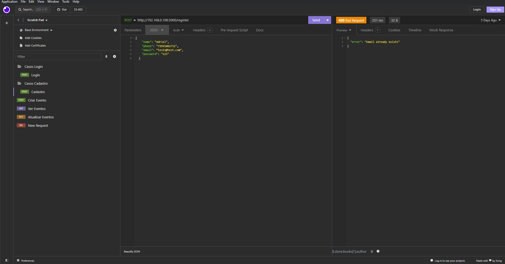
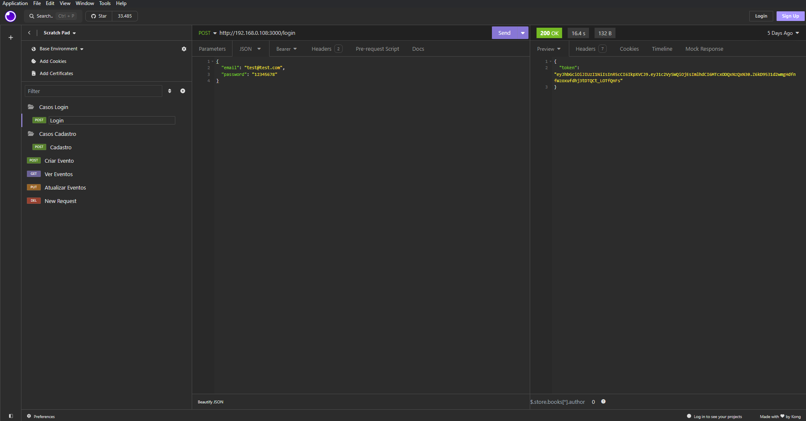
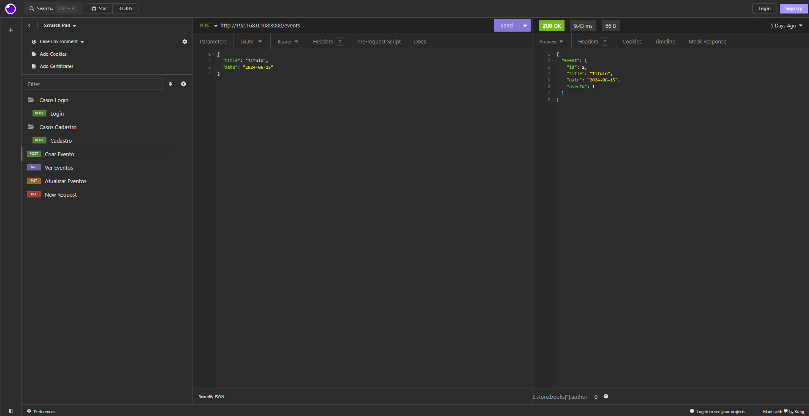
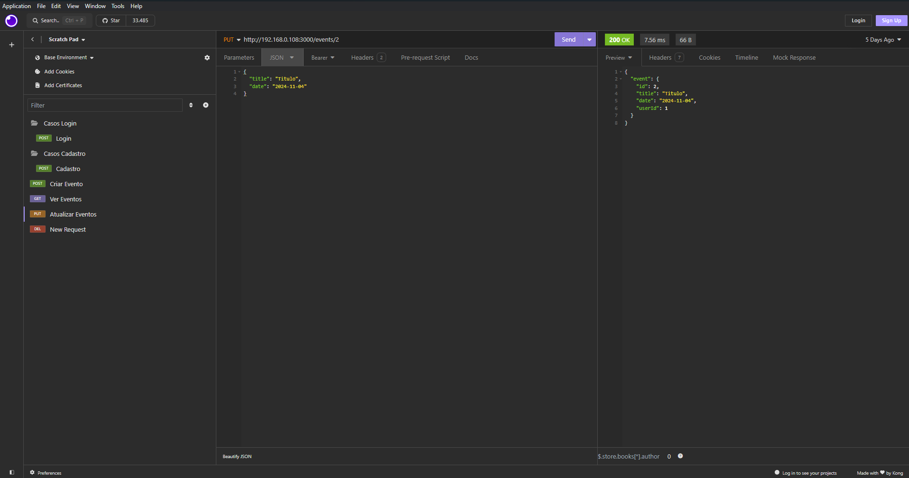
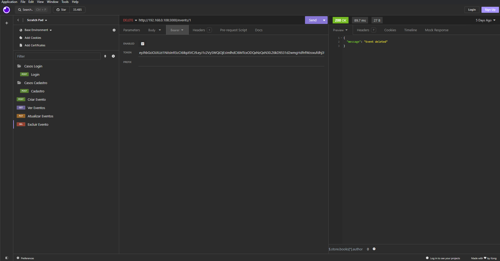

# Registro de Testes de Software

## Plano de Teste 01 – Cadastro de novo usuário

## Plano de Teste 02 – Login de usuário

## Plano de Teste 03 – Criação de Evento

## Plano de Teste 04 – Visualização de Evento

## Plano de Teste 05 – Edição de Evento

## Plano de Teste 06 – Exclusão de Evento

> **Links Úteis**:
> - [Ferramentas de Test para Java Script](https://geekflare.com/javascript-unit-testing/)
