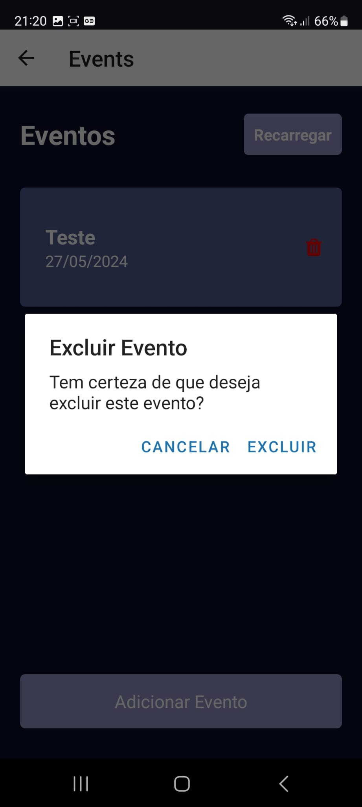

# Registro de Testes de Usabilidade

## Caso de Teste 01 – Cadastro de novo usuário

## Caso de Teste 02 – Login de usuário

## Caso de Teste 03 – Editar Perfil

## Caso de Teste 04 – Criar Eventos

## Caso de Teste 05 –  Editar Evento

## Caso de Teste 06 – Excluir Evento

## Caso de Teste 07 – Listar Eventos

